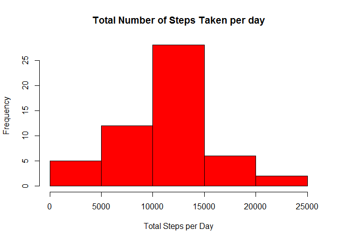
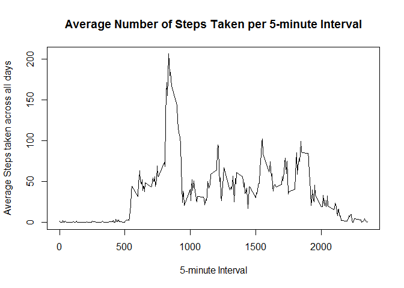
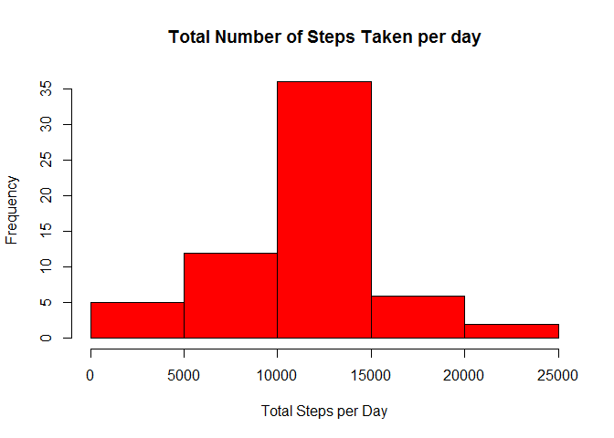

# Reproducible Research: Peer Assessment 1 by Timothy Elson


This is my submission for the first peer review assessment for the Reproducible Reasearch course.

The assignment asks us to download the data from the https://d396qusza40orc.cloudfront.net/repdata%2Fdata%2Factivity.zip

I downloaded this data and saved it into the working director for R.

## Loading and preprocessing the data

I first read the csv file into R and assigned it to x, loaded the library dplyr (this assumes you already have it downloaded), ignore the load errors created by loading dplyr and assinged x to a dataframe xx, using the below R code:

```r
x <- read.csv("activity.csv")
library(dplyr)
```

```
## Warning: package 'dplyr' was built under R version 3.2.3
```

```
## 
## Attaching package: 'dplyr'
```

```
## The following objects are masked from 'package:stats':
## 
##     filter, lag
```

```
## The following objects are masked from 'package:base':
## 
##     intersect, setdiff, setequal, union
```

```r
xx <- tbl_df(x)
```

I created the variable x1 which removed NA values from the xx dataframe using the complete cases R command:

```r
x1 <- xx[complete.cases(xx),]
```

The varibale p2 is the total steps per day formatted for use in the historgram.

```r
p2 <- with(x1, tapply(steps, date, sum))
```

The varibale p is the total steps per day.

```r
p <- summarise(group_by(x1,date),sum.steps = sum(steps))
```

The below R code creates a varibale, gg, which is a mean of steps taken per 5 minute interval. It uses x1, so ignores NA values.

```r
gg <- aggregate(x1$steps, by=list(Category=x1$interval), FUN=mean)
colnames(gg) <- c("Interval","Average.steps")
```

## What is mean total number of steps taken per day?

The code below makes a histogram of the distribution of the total number of steps taken each day ignoring NA values.

```r
hist(p2,  col = "red", xlab = "Total Steps per Day", ylab = "Frequency", main = "Total Number of Steps Taken per day")
```



The below R code generates a summary of the mean and median steps taken per day on the dataset.

```r
summarise(p, mean.steps.per.day = mean(sum.steps), median.steps.per.day = median(sum.steps))
```

```
## Source: local data frame [1 x 2]
## 
##   mean.steps.per.day median.steps.per.day
##                (dbl)                (int)
## 1           10766.19                10765
```

## What is the average daily activity pattern?

The code below creates a line graph of the average number of steps taken in each given 5 minute interval taken across all days.

```r
plot(gg, type = "l", xlab = "5-minute Interval", ylab = "Average Steps taken across all days", main = "Average Number of Steps Taken per 5-minute Interval")
```



The below code returns the 5-minute interval that on average across all the days in the dataset, contains the maximum number of steps.

```r
gmax <- subset(gg, Average.steps == max(gg$Average.steps))
gmax
```

```
##     Interval Average.steps
## 104      835      206.1698
```

## Imputing missing values

The code below calculates the total number of missing values in the dataset.

```r
sum(is.na(x$steps))
```

```
## [1] 2304
```

Below is my strategy for imputing the missing values.  
Is uses the merge function to the intial dataset x, with the dataset with the NA values striped out and the average of the 5-minute interval being calculated, gg. It joins on the interval.  
I them create a new column in the data set in imp2 which is populated with the average number of steps for that interval if it is NA. The imp2 dataset is equal to the orginal dataset put has the missing steps data added in.  
I then created a smaller dataset in called newx to work with to make the hisogram.

```r
imp <- merge(x,gg, by.x = "interval", by.y = "Interval") 
imp2 <-mutate(imp, adj.steps = ifelse(is.na(steps),Average.steps, steps)) 
newx <- select(imp2, adj.steps, date, interval)
```

I then created an histogram showing the total number of steps taken each day with the imputed data added in.

```r
newp2 <- with(newx, tapply(adj.steps, date, sum))
hist(newp2,  col = "red", xlab = "Total Steps per Day", ylab = "Frequency", main = "Total Number of Steps Taken per day")
```



The new mean and median based on the imputed data is:

```r
newp <- summarise(group_by(newx,date),sum.steps = sum(adj.steps))
newpp <- summarise(newp, mean.steps.per.day = mean(sum.steps), median.steps.per.day = median(sum.steps))
newpp
```

```
## Source: local data frame [1 x 2]
## 
##   mean.steps.per.day median.steps.per.day
##                (dbl)                (dbl)
## 1           10766.19             10766.19
```

This can be compared to the original mean and median:

```r
summarise(p, mean.steps.per.day = mean(sum.steps), median.steps.per.day = median(sum.steps))
```

```
## Source: local data frame [1 x 2]
## 
##   mean.steps.per.day median.steps.per.day
##                (dbl)                (int)
## 1           10766.19                10765
```

It can be seen that median and mean match on the imputed data, because using the means for NA values has sweked the medium towards the mean.  
The mean between the original and imputed data set's is the same and the median is slightly higher.

## Are there differences in activity patterns between weekdays and weekends?

The variable created below called newx2 adds in a column for whether a day is a weekday or a weekend.

```r
newx2 <- mutate(newx, weekend.weekday = ifelse(weekdays(as.Date(newx$date, "%Y-%m-%d"), abbr = TRUE) == "Sat"|weekdays(as.Date(newx$date, "%Y-%m-%d"), abbr = TRUE) == "Sun", "weekend","weekday"))
```

The code below creates a time series pannel plot comparing the weekend to weekday mean number of steps against the time interval.

```r
library(lattice)
newx3 <- select(newx2,interval,weekend.weekday,adj.steps)
newgg <- aggregate( . ~ interval+weekend.weekday, data = newx3, FUN=mean)
xyplot(adj.steps~interval|weekend.weekday, newgg, layout = c(1,2), type="l", xlab = "Interval", ylab="Number of steps")
```


The plot shows that on a weekend the activity pattern is more spread out and without as big spike at approximately time interval 835. The weekend spikes are also lower than the weekday spikes. 
